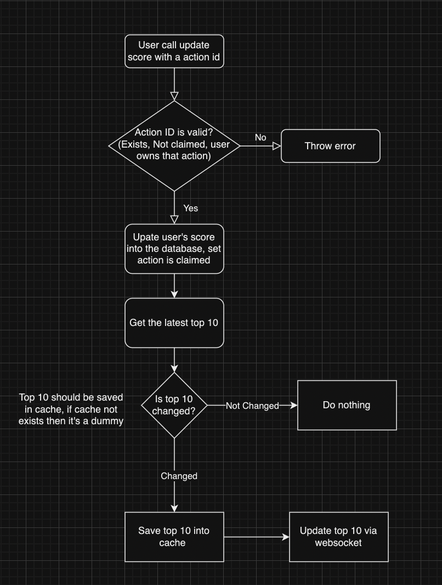

## Database

* Table `action` with `id`, `isClaimed` and `userId`
* Table `score` wit `userId` and `value`

## API

* `PUT /score` with `userId` and `actionId`
* `GET /score/board`

## Note:

* Checking `actionId` (including not claimed, ownership), marking it as claimed, increasing score should be done in a single transaction.
(There could be other ways to do it but this is the simplest way.)

* `GET /score/board` should return the top 10 users with the highest score.
This 10 users should be cached, if the cache is empty or expired, it should be recalculated.

* If there is too many actions happen in a short time, we should not recalculate the top 10 users for each action, instead we should debounce the recalculation for a specific time range like 1s or 1m depends on the requirements.

Ex: If in 1s there are 1000 actions and many of that can affect top 10, recalculating for each action seems like a waste of resources as the users (looking at the UI) cannot read all the changes that quick. So it is reasonable to recalculate it every 1s.

* Not all the actions should trigger the recalculation, if the score of that user is less than the 10th user, it should not trigger the recalculation.
